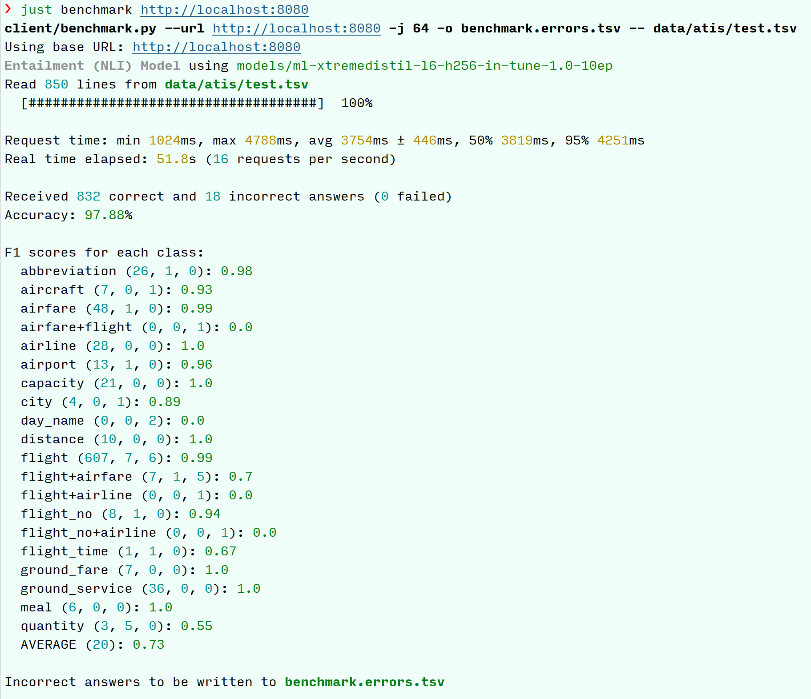

# Intent Classifier

We fine-tune an entailment (NLI)
model with 12 million parameters and use it in an intent classification service.

## Deploying the Service

The core classifier service is located in the [`server`](./server) folder.
The preferred method of running is containerized using your favorite container tool.

### Containerized Service

An example invocation to run the service locally
is in the [`justfile`](justfile) and can be run with something like

```shell
# modify container_tool variable if you use Docker
just serve 8080
```

if you have the **[just](https://github.com/casey/just)** tool installed.

### Local Testing

Alternatively, the script [`server/server.py`](server/server.py) can be run
directly from an appropriate Python environment
(it can be set up from [`server/requirements.txt`](server/requirements.txt)).
This should also pick up the GPU device by default.

### Kubernetes Deployment

The demo version of the classifier is deployed to my personal cluster at
**[intents.cluster.megaver.se](https://intents.cluster.megaver.se/info)**.
It's an economically built cluster, so the performance isn't great, but you can
test it with a request tool of your choice.

The Kubernetes manifest for deploying the service is shown on **[docs.cluster.megaver.se](https://docs.cluster.megaver.se/cluster/automatic/apps/intent-classifier.yaml)**

## Accessing the Service

### Benchmarking Client

There is a benchmarking client provided in the [`client`](./client) folder.
It computes the average accuracy and F1 scores for the label classes.
You can invoke it on the test part of the ATIS dataset with

```shell
# pip install -r client/requirements.txt -- if necessary
just benchmark
```

### API Access

In addition to the [provided requirements](docs/TASK.md) regarding the `/version` and `/predict`
endpoints there are the following features implemented:

1. The `/predict` endpoint accepts the `requested_model` key that can select a specific model. Several models can be specified as an argument or using the `MODEL` environment variable. The first model is the default one.
2. A separate endpoint `/info` returns information about the service.

## Testing Results

### Classification Performance

We run the local ATIS benchmark as discussed above:



The model obtains the accuracy of almost 98% on the test data.
Among the 18 [model errors](docs/assets/local-benchmark-atis-test-1.0-10ep.errors.tsv) we have

- 2 rows with the unknown label `day_name`
- 1 row that seems to be correctly classified by our model as `airfare`
- 1 row that seems to be correctly classified by our model as `flight+airfare`
- 5 rows that seem to be correctly classified by our model as `quantity`
- 6 rows where `flight` and `flight+airfare` are mixed up
- 1 row similarly about `flight_no`
- 1 cut-off phrase
- 1 genuine mistake (`airport` instead of a `flight`)

Overall, we are quite happy about the model's classification performance.

### Deployed Service Testing

The service in the cluster isn't able to handle the `--jobs 64` parameter
as above for the local test, so we use the `--jobs 3` to test it:


We have 1 failure,
but otherwise the classification results are, as expected, the same.
Our service has an average request time of 0.5 seconds and a throughput of 6 requests per second.
One could improve the throughput
by batching the requests using a message queue
and performing an inference on a GPU instance.

## Building the Model

See **[docs/README.md](docs/README.md)** to learn how the model was selected and fine-tuned.

## Contributing

See **[CONTRIBUTING.md](CONTRIBUTING.md)** for the code style and workflow information.
